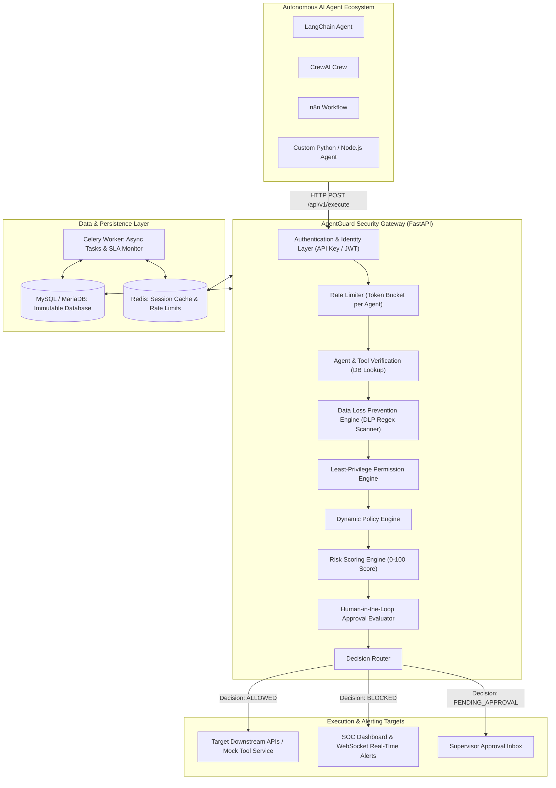

# AgentGuard Architecture & Technical Specification

AgentGuard is a deterministic security firewall, governance layer, and monitoring platform designed specifically for autonomous AI agents.

---

## 1. High-Level System Architecture



---

## 2. Core Architectural Principles

### A. Deterministic Enforcement Over Probabilistic AI
AgentGuard does **not** rely on another LLM to guard the primary LLM. Using an LLM to police another LLM introduces hallucinations, prompt-injection inheritance, non-deterministic latency, and unpredictable edge cases. Instead, AgentGuard enforces **hard, deterministic rules in code and database constraints**:
- Exact regex pattern matching for credential detection (AWS keys, OpenAI secrets, JWTs, credit cards).
- Database foreign keys and permission links between agents and permitted tools.
- Strict numeric boundary comparisons for financial thresholds (e.g. `amount <= limit`).
- Millisecond-scale evaluation latency ($<15\text{ms}$).

### B. Inline Proxy Gateway Model
Rather than embedding security code inside every agent script, AgentGuard operates as a centralized gateway (`POST /api/v1/execute`). This provides:
1. **Language Agnosticism**: Any agent runtime that can make an HTTP call (Python, TypeScript, Go, Java, n8n, Zapier) is immediately secured.
2. **Centralized Audit Trail**: Security teams inspect and revoke credentials centrally without modifying downstream agent source code.
3. **Emergency Kill-Switch**: SOC analysts can pause or disable an agent with a single click, instantly severing tool access.

### C. Human-in-the-Loop (HITL) for Asymmetric Risk
Actions with catastrophic blast radii (e.g., refunds exceeding ₹10,000, database schema migrations, bulk email blasts) should not execute autonomously, even if the agent believes it is justified. AgentGuard halts the execution in `PENDING_APPROVAL` status, notifies supervisors via WebSockets, and only dispatches the tool call once authorized by a human supervisor.

---

## 3. The 8-Stage Security Pipeline

When an agent requests tool execution, the request traverses 8 deterministic pipeline stages:

| Stage # | Stage Name | Purpose | Failure Mode |
|---|---|---|---|
| **1** | **Authentication & Identity** | Validates SHA-256 hashed `X-API-Key` or Bearer JWT | Returns `401 Unauthorized` |
| **2** | **Agent Identification** | Confirms agent exists in DB and status is `ACTIVE` | Returns `403 Forbidden` (`Agent Paused`) |
| **3** | **Tool Authorization** | Confirms tool exists, is enabled, and is bound to agent | Returns `BLOCKED` (`Least Privilege Violation`) |
| **4** | **Sensitive Data (DLP) Scan** | Regex search for credentials, AWS keys, credit cards, PII | Redacts secrets; flags critical leaks for blocking |
| **5** | **Permission & Least Privilege** | Checks action verb and parameter limits (financial cap) | Triggers `PENDING_APPROVAL` or `BLOCKED` |
| **6** | **Policy Engine Evaluation** | Evaluates active company rules (e.g., delete policies) | Adds policy violation; updates decision |
| **7** | **Risk Engine Scoring** | Calculates composite risk score (0 to 100) and severity | Classifies `LOW`, `MEDIUM`, `HIGH`, `CRITICAL` |
| **8** | **Approval Gate & Execution** | Dispatches to safe executor or holds in Approval queue | Returns tool output or pauses execution |

---

## 4. Database Architecture & Data Models

AgentGuard utilizes 12 relational models managed via SQLAlchemy:

1. **`User`**: System administrators, SOC analysts, and security auditors. Supports bcrypt hashing and role-based access control (`ADMIN`, `ANALYST`, `DEVELOPER`, `AUDITOR`).
2. **`Agent`**: Autonomous agent profiles with status (`ACTIVE`, `PAUSED`, `ARCHIVED`) and provider metadata.
3. **`Tool`**: Registered enterprise tools (`customer.read`, `refund_customer`, `database.export`, `ticket.create`).
4. **`AgentTool`**: Many-to-many junction establishing which agents are allowed to access which tools.
5. **`Permission` & `AgentPermission`**: Granular action-level allowances with parameter constraints (e.g., `max_amount: 10000`).
6. **`Policy`**: Dynamic security policies (financial limits, destructive operation blocks, DLP rules).
7. **`Execution`**: Immutable ledger of every tool call attempted, including sanitized payload, decision, risk score, duration, and pipeline breakdown.
8. **`Approval`**: State tracking for actions awaiting supervisor review (`PENDING`, `APPROVED`, `REJECTED`, `EXPIRED`).
9. **`Incident`**: Security alerts generated upon critical policy violations or attack patterns.
10. **`AuditLog`**: Tamper-evident operational audit trail.
11. **`ApiKey`**: SHA-256 hashed external keys used by agents and orchestrators.
12. **`SecurityTest`**: Results and vulnerability findings from the automated red team simulator.

---

## 5. Network & Container Topology

```
                  ┌──────────────────────────────────────────────┐
                  │          Host Machine Ports                  │
                  │  5173 (Web) | 8000 (API) | 5678 (n8n)        │
                  └──────────────┬───────────────────────────────┘
                                 │
     Docker Bridge Network: agentguard-network (172.28.0.0/16)
  ┌──────────────────────────────────────────────────────────────┐
  │                                                              │
  │  ┌───────────────────┐               ┌───────────────────┐   │
  │  │ agentguard-       │               │ agentguard-       │   │
  │  │ frontend (Nginx)  │               │ backend (FastAPI) │   │
  │  │ Port 80 -> 5173   │               │ Port 8000 -> 8000 │   │
  │  └─────────┬─────────┘               └─────────┬─────────┘   │
  │            │ proxy /api/ & /ws/                │             │
  │            └───────────────────────────────────┤             │
  │                                                │             │
  │  ┌───────────────────┐                         │             │
  │  │ agentguard-       │                         │             │
  │  │ n8n (Orchestrator)│───────────┐             │             │
  │  │ Port 5678 -> 5678 │           │             │             │
  │  └───────────────────┘           │             │             │
  │                                  │             │             │
  │  ┌───────────────────┐           ▼             ▼             │
  │  │ agentguard-worker │    ┌───────────────────────────────┐  │
  │  │ (Celery)          │    │ agentguard-mysql (Port 3306)  │  │
  │  └─────────┬─────────┘    │ agentguard-redis (Port 6379)  │  │
  │            │              └───────────────────────────────┘  │
  │            └─────────────────────────────▲                   │
  └──────────────────────────────────────────────────────────────┘
```
